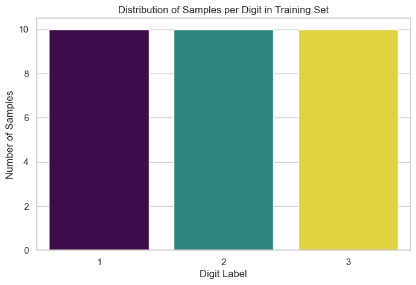
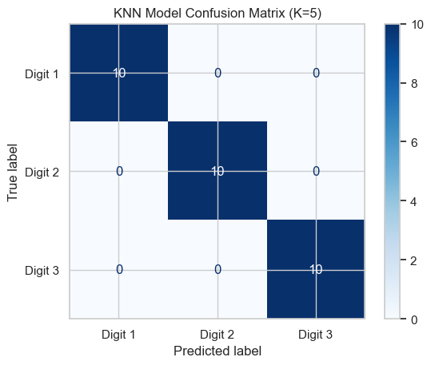

# Handwritten Digit Recognition Project

## 1. Project Overview
This project was developed as the **final assignment for a Data Science course**. It aims to apply machine learning principles taught in the course by training and comparing four different models (K-Nearest Neighbors, Naive Bayes, Logistic Regression, and SVM) to solve a handwritten digit classification problem and identify the best-performing model for the provided dataset.

## 2. Dataset Description
- **Source:** The dataset was **provided by the Data Science course** and is contained in a `.mat` file (`digit_123.mat`).
- **Features:** Each sample is a handwritten digit represented by a vector of **256 features**. These features correspond to pixel values that can be reshaped into a **16x16 grayscale image**.
- **Size and Labels:** The dataset is split into a training set of **30 samples** and a test set of **30 samples**. There are three classes of digits ('1', '2', '3'), with each class being perfectly balanced (10 samples per class in both training and test sets).

## 3. Methodology
The project followed a standard machine learning pipeline:
1.  **Data Loading & Parsing:** Data was loaded from the `.mat` file and parsed into separate arrays for training/testing features and labels.
2.  **Data Reshaping:** The raw 1D feature vectors were reshaped into a standard `(n_samples, n_features)` matrix format.
3.  **Exploratory Data Analysis (EDA):** A visual exploration was performed on the raw data to understand its basic characteristics. This included viewing individual samples, checking for class balance (as shown below), and observing the "average image" for each digit.
4.  **Feature Scaling:** `StandardScaler` was applied to the feature data to normalize its scale (mean=0, std=1). This is a crucial step for models like SVM and Logistic Regression.
5.  **Model Training & Evaluation:** Four different classification models were trained and evaluated on the scaled test data.
6.  **Troubleshooting:** Addressed environment-specific issues on Apple Silicon (M2) by selecting alternative solvers (`saga`) and kernels (`linear`) to ensure model stability.
7.  **Core Algorithm Implementation from Scratch:** As part of the course requirements to ensure a deep understanding of the internal principles, the core logic of the KNN algorithm was implemented manually from scratch, in addition to using the standard scikit-learn library. This included efficient vectorized distance calculation and a voting mechanism.

## 4. Model Performance Comparison
The performance of all models on the test set is summarized below, including a comparison between the library and from-scratch KNN implementations.

| Model                               | Accuracy | Macro Avg F1-Score |
| ----------------------------------- | :------: | :----------------: |
| K-Nearest Neighbors (scikit-learn)  |  1.0000  |       1.0000       |
| K-Nearest Neighbors (from scratch)  |  1.0000  |       1.0000       |
| Logistic Regression                 |  1.0000  |       1.0000       |
| Linear SVM                          |  0.8667  |       0.8611       |
| Naive Bayes                         |  0.6333  |       0.6007       |

## 5. Analysis and Conclusion
The experimental results show that **K-Nearest Neighbors (KNN)** and **Logistic Regression** achieved a perfect accuracy of 100%. Notably, the from-scratch implementation of KNN achieved identical results to the `scikit-learn` version, validating the correctness of our custom algorithm's logic and implementation.

This strong overall result suggests that the dataset is highly separable, likely due to the distinct nature of the digit features and the small size of the test set. The high performance of the **Linear SVM** further supports this conclusion. **Naive Bayes** performed the poorest, likely because its core assumption of feature independence is not valid for pixel-based image data.

A key takeaway was the importance of addressing environment-specific challenges, as successfully running Logistic Regression and SVM required using non-default parameters to ensure stability on Apple Silicon hardware.

### Training Set Sample Distribution
The class distribution in the training and test sets is perfectly balanced, which avoids potential model bias caused by imbalanced data.

### Best Model Confusion Matrix (Example: KNN)

## 6. Usage
1.  Clone this repository.
2.  Install dependencies: `pip install -r requirements.txt`
3.  Open `test.ipynb` and run all cells in order to reproduce the results.